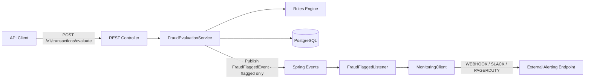

# Fraud Rule Engine (Java)

Spring Boot service that evaluates categorized transaction events against fraud rules, persists results, and exposes an API for retrieval.

This project supports two execution modes:

- **Path A – Local development:** Run Postgres via Docker, app via Maven
- **Path B – Full Docker:** Run both database and app via Docker Compose


---

## Tech

- Java 21 
- Spring Boot  
- PostgreSQL  
- Flyway  
- Docker Compose  

---

## Run via Docker

This project uses Docker Compose for PostgreSQL and a Dockerfile for the application.

### 1. Start the stack

From the project root:

```bash
docker compose up --build -d
```

This starts:

- fraudruleengine-app (Spring Boot API)

- fraudruleengine-db (PostgreSQL)

Database Details:

- Database: fraud

- Username: fraud

- Password: fraud

- Port: 5432

API is exposed on:

```json
http://localhost:8081
```

### 2. Verify Health

```bash
curl.exe http://localhost:8081/actuator/health
```

Expected:

```json
{"status":"UP"}
```

### 3. Evaluate a transaction

```bash
curl.exe -i -X POST "http://localhost:8081/v1/transactions/evaluate" `
  -H "Content-Type: application/json" `
  --data-binary "@request.json"
```


### 4. View Logs:

```bash
docker compose logs -f app

```

### 5. Stop / cleanup

```bash
docker compose down
```

---

## Run locally

```bash
docker compose up -d db
./mvnw spring-boot:run
```

Service starts at:

```json
http://localhost:8080
```
(Note: Docker mode exposes the API on port 8081; local mode uses 8080.)


---

## Architecture Overview

The system is designed to remain stateless at the application layer to support horizontal scaling behind a load balancer. This service follows a layered architecture:

- API layer receives transaction events
- Domain layer evaluates fraud rules
- Persistence layer stores transactions, cases, and rule hits
- PostgreSQL is used for durable storage
- Flyway manages schema migrations

### High-level flow



Each transaction is persisted first, then evaluated.  
Rule hits and fraud cases are stored atomically in a single transaction.

### System Architecture

This diagram shows the high-level structure of the Fraud Rule Engine service and its integrations.


### Fraud Detection Event Flow

This diagram illustrates how a transaction is evaluated and how flagged events are emitted to the monitoring layer.

Transaction Event
    → Fraud Rules Evaluation
        → Risk Score Calculation
            → Flag Decision
                → FraudFlaggedEvent
                    → FraudFlaggedListener
                        → MonitoringClient
                            → Webhook / PagerDuty / Slack


### Deployment Architecture

This diagram illustrates how the Fraud Rule Engine is deployed and how its components interact within a containerized environment.


---

## Monitoring / Alerting

When a transaction is **flagged**, `FraudEvaluationService` publishes a `FraudFlaggedEvent`.
`FraudFlaggedListener` consumes the event **after the DB transaction commits** (`AFTER_COMMIT`) and calls `MonitoringClient`.

For this take-home, the recommended demo path is **WEBHOOK** (works with webhook.site), but the abstraction supports Slack and PagerDuty as well. Alerts are emitted asynchronously to avoid increasing API latency.

### Configuration (environment variables)

| Variable                 | Meaning                             | Default             |
|--------------------------|-------------------------------------|---------------------|
| `ALERT_ENABLED`          | Enable/disable alerts               | `true`              |
| `ALERT_PROVIDER`         | `WEBHOOK` \| `SLACK` \| `PAGERDUTY` | `WEBHOOK`           |
| `ALERT_WEBHOOK_URL`      | Destination URL for WEBHOOK/SLACK   | *(blank)*           |
| `ALERT_SOURCE`           | Source field for alert payload      | `fraud-rule-engine` |
| `ALERT_SEVERITY_HIGH`    | Severity for flagged cases          | `critical`          |
| `PAGERDUTY_ROUTING_KEY`  | PagerDuty Events API key (optional) | *(blank)*           |

If `ALERT_WEBHOOK_URL` is blank, `MonitoringClient` uses a **demo fallback webhook.site URL** (documented in code) to keep local testing simple.

### Example webhook payload

```json
{
  "source": "fraud-rule-engine",
  "severity": "critical",
  "summary": "FLAGGED fraud case: tx=... riskScore=... merchant=... amount=... ...",
  "details": {
    "transactionId": "tx-high-123",
    "riskScore": 100,
    "anyHigh": true,
    "customerId": "cust-1",
    "merchant": "SHOPRITE",
    "amount": 70000,
    "currency": "ZAR",
    "eventTime": "2026-02-01T10:00:00Z",
    "ruleIds": ["HIGH_AMOUNT", "VELOCITY"]
  }
}
```

---

## Project Structure

```
src/main/java/com/example/FraudRuleEngine
├── api          # REST controllers + DTOs
├── config       # Rule + Jackson configuration
├── domain       # Core fraud models and rules
├── persistence  # JPA entities + repositories
└── service      # FraudEvaluationService orchestration
```

---

## Rules Configuration

Rules are wired via Spring configuration in `RulesConfig`:

- HighAmountRule (threshold: 50,000)
- MerchantWatchlistRule (ACME, BINANCE)
- VelocityRule (5 transactions in 2 minutes)

Rules are injected as a list and evaluated sequentially.

New rules can be added by:

1. Implementing `FraudRule`
2. Registering in `RulesConfig`

---

## Fraud Scoring & Rule Evaluation

### Rule evaluation

Each rule may return a `RuleHit`.  
All hits are collected and persisted.

### Risk scoring

Risk score is calculated from severities:

- LOW = 10 points  
- MEDIUM = 30 points  
- HIGH = 70 points  

Final score = sum of triggered severities, capped at 100.

### Flagging logic

A transaction is flagged when:

- Any HIGH severity rule triggers  
- OR total risk score ≥ 70  

---

## Velocity Rule

The velocity rule detects bursts of activity per customer.

Logic:

- Counts transactions for the same customer
- Within a rolling time window
- Current transaction is included (already persisted)

Trigger condition:

```
count > maxCount
```

This avoids off-by-one errors.

Example:

Window: 2 minutes  
Max: 5  

Trigger occurs on the 6th transaction.

Velocity uses database counting instead of in-memory state to remain stateless and horizontally scalable.

---

## Persistence Model

Tables:

- `transactions` – raw events + payload (JSONB)
- `fraud_cases` – one per transaction
- `rule_hits` – one per triggered rule

Relationships:

```
transactions → fraud_cases → rule_hits
```

Foreign keys use `ON DELETE CASCADE` to allow clean test resets.

JSONB is used for:

- raw transaction payload
- rule metadata

This enables auditability and debugging.

---

## API Reference

Base path: /v1
Content-Type: application/json
All endpoints are versioned under /v1 to support backward-compatible future changes.


### 1. Evaluate a transaction

Endpoint

```bash
POST /v1/transactions/evaluate
```

Description
Evaluates a transaction against configured fraud rules and returns a risk assessment.

Example request

```bash
curl -i -X POST http://localhost:8081/v1/transactions/evaluate \
  -H "Content-Type: application/json" \
  -d '{
    "transactionId": "tx-99",
    "amount": 12500,
    "currency": "ZAR",
    "merchant": "merchant-001",
    "customerId": "customer-123",
    "category": "groceries",
    "eventTime": "2026-02-01T10:00:00Z"
  }'
```

Sample success response (200 OK)
```json
{
  "transactionId": "tx-99",
  "flagged": false,
  "riskScore": 0,
  "ruleHits": []
}
```

### 2. Retrieve a case by transaction ID

Endpoint
```bash
GET /v1/cases/{transactionId}
```

Validation

- transactionId must not be blank

- Max length: 64 characters

Example request
```bash
curl -i http://localhost:8081/v1/cases/tx-99
```

Sample success response (200 OK)
```json
{
  "transactionId": "tx-99",
  "flagged": false,
  "riskScore": 0,
  "ruleHits": []
}
```

### 3. Validation error example

Invalid transaction ID (blank)
```bash
curl -i http://localhost:8081/v1/cases/
```

Sample error response (400 Bad Request)
```json
{
  "timestamp": "2026-02-07T17:30:00Z",
  "status": 400,
  "error": "Bad Request",
  "message": "Validation failed",
  "path": "/v1/cases/",
  "fieldErrors": [
    {
      "field": "transactionId",
      "message": "transactionId is required"
    }
  ]
}
```
---

## Swagger / OpenAPI (optional)

Swagger/OpenAPI was briefly introduced using springdoc-openapi, but it is currently disabled to keep the submission stable and focused on core functionality.

---

### Quick Test Example 

### 1. Evaluate a transaction (example)

```bash
curl -i -X POST http://localhost:8081/v1/transactions/evaluate \
  -H "Content-Type: application/json" \
  -d '{
    "transactionId": "TX-1001",
    "amount": 12500.00,
    "currency": "ZAR",
    "merchant": "SHOPRITE",
    "customerId": "C-9911",
    "category": "groceries",
    "eventTime": "2026-02-07T17:00:00Z"
  }'
```

Sample success response (200):

```json
{
  "transactionId": "TX-1001",
  "flagged": false,
  "riskScore": 0,
  "ruleHits": []
}
```

### 2. Invalid request example (validation failure)

```bash
curl -i -X POST http://localhost:8081/v1/transactions/evaluate \
  -H "Content-Type: application/json" \
  -d '{
    "transactionId": "",
    "amount": -5
  }'
```

Sample error response (400):

```json
{
  "timestamp": "2026-02-07T17:20:00+02:00",
  "status": 400,
  "error": "Bad Request",
  "message": "Validation failed"
}
```

---


## Validation & Errors

Incoming requests are validated using Bean Validation (jakarta.validation).

Validation rules

The request DTO applies constraints such as:

- @NotBlank for required IDs (transactionId, customerId)

- @NotNull for required fields (amount, eventTime)

- @Positive for amount

- @Size limits for strings (IDs, merchant, category, currency)

Validation is enforced on the evaluate endpoint via @Valid.

**Error responses (HTTP 400)**

If validation fails, the API returns HTTP 400 Bad Request with a JSON response that includes:

- a general message

- a list of field-level errors

Example:
```json
{
  "timestamp": "2026-02-03T18:52:58Z",
  "status": 400,
  "error": "Bad Request",
  "message": "Validation failed",
  "errors": [
    "transactionId: transactionId is required",
    "amount: amount must be greater than 0"
  ]
}
```
Notes:

- The errors array contains one entry per invalid field.

- The exact timestamp format may vary.

---

## Demo

A demo PowerShell script is included:

```bash
powershell -ExecutionPolicy Bypass -File .\scripts\demo.ps1
```

This runs three scenarios:

### 1. High Amount

Amount exceeds configured threshold.

Triggers `HIGH_AMOUNT`.

Transaction is flagged.

---

### 2. Watchlist Merchant

Merchant is on watchlist (ACME / BINANCE).

Triggers `MERCHANT_WATCHLIST`.

Medium risk score applied.

---

### 3. Velocity Burst

Sends 6 transactions rapidly for the same customer.

Velocity allows 5 within the window.

6th transaction triggers `VELOCITY`.

---

Expected results:

- High amount → flagged (HIGH severity)
- Watchlist → medium score
- Velocity → triggers on 6th transaction

---

## Reset Database

To clear demo data while keeping schema:

```bash
powershell -ExecutionPolicy Bypass -File .\scripts\reset-db.ps1
```

This truncates:

- rule_hits
- fraud_cases
- transactions

Foreign keys use cascade so cleanup is safe.

---

## Testing

Currently:

- Manual demo via PowerShell script

Planned:

- Unit tests per rule
- Integration tests with Testcontainers
- API contract tests

---

## Stop Environment

```bash
docker compose down
```

---

## Design Decisions

- Transactions are persisted before rule evaluation to support velocity counting.
- JSONB is used for raw payloads and rule metadata for auditability.
- Rules use interface abstraction for extensibility.
- Scoring is additive and capped for simplicity and explainability.
- Velocity is database-backed instead of in-memory to remain stateless.
- Foreign keys use cascade for clean test resets.

---

## Future Improvements

- Async ingestion via Kafka
- Redis-based velocity counters
- Rule versioning + activation flags
- Admin UI for managing thresholds
- Idempotency keys
- JWT authentication
- Metrics per rule
- Rule execution tracing

---
